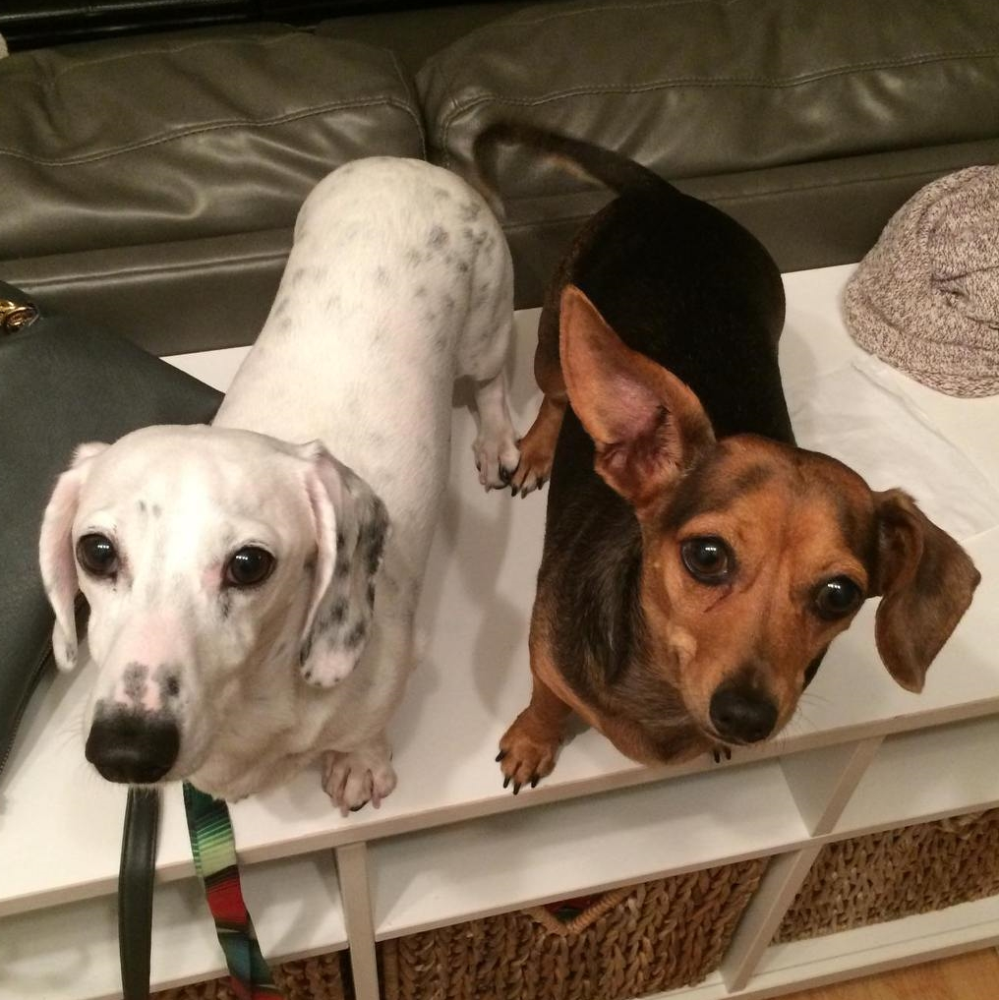

# Get Your Toy

You play as a dog whose owner wants to play with you, but you've lost your toy.
Find your toy and return home before your owner decides to do something else.
Collect treats and bones along the way, and try to be as quick as possible to earn a high score.

You can [play the game by going here](https://makecode.com/_5Yr2A9iUFF0A).
The only controls are the arrow keys to move your dog.

## Technology and credits

This game was created using [MakeCode Arcade](https://arcade.makecode.com) for [Global Game Jam](https://globalgamejam.org) 2021 by my 9 year old son and I.

Many of the images were created by my son and I (dogs and pick-up items).
Most of the level tiles and all of the sound effects were free ones from the gallery.

## Dedication

This game is dedicated to our dog Molly (brown dog in picture below), who passed away a couple weeks before the game jam.
We will forever miss her.

## Donate

Buy my son some [Timbits](https://www.google.com/search?q=timbits) (donut holes) for providing this game open source and for free :)

